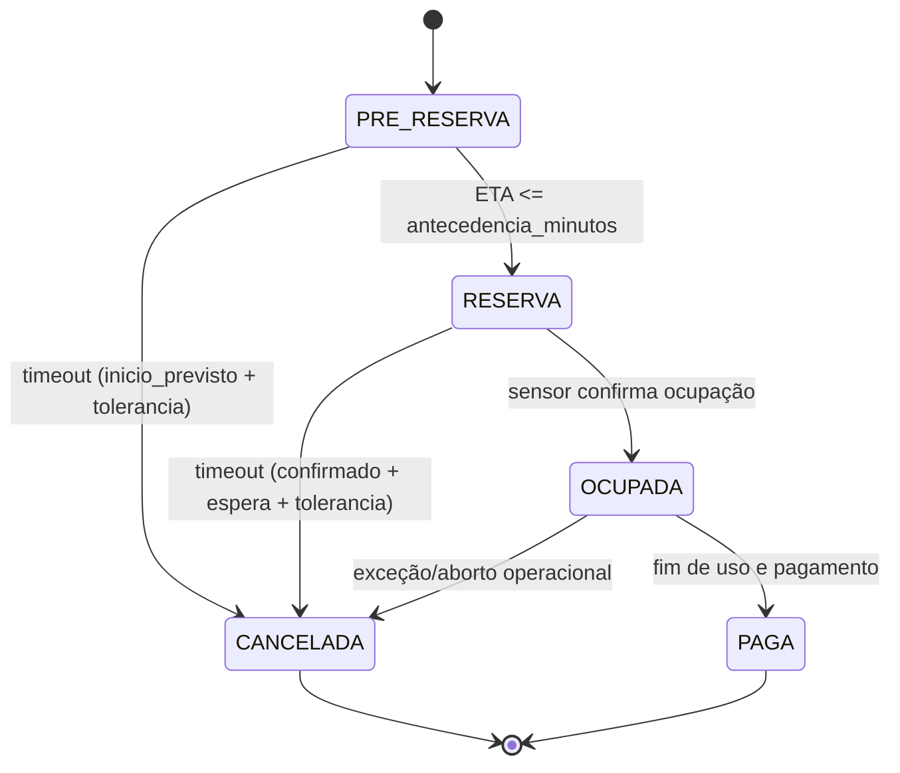

# EasyPark — API Java

> Sistema multi-estacionamento com **reservas em estágios** (PRE_RESERVA → RESERVA → OCUPADA → PAGA/CANCELADA), **monitoramento em tempo real** via sensores de vaga e **pagamento pós-uso**. Integra com **Oracle** e usa **ETA** (Google Maps Directions) para promover PRE_RESERVA → RESERVA.

**Status atual:** Sprint 2 — evoluções de arquitetura, padronização de respostas, início de HATEOAS (maturidade REST nível 3) e documentação reforçada.  
**Repositório:** `kgb-fiap/easypark-java`  

---

## Sumário
- [Visão Geral](#visão-geral)
- [Arquitetura](#arquitetura)
- [Domínio e Modelo de Dados](#domínio-e-modelo-de-dados)
- [Fluxo de Reserva](#fluxo-de-reserva)
- [Stack Tecnológica](#stack-tecnológica)
- [Como Executar Localmente](#como-executar-localmente)
- [Documentação da API (Swagger/OpenAPI)](#documentação-da-api-swaggeropenapi)
- [Padrões REST e HATEOAS](#padrões-rest-e-hateoas)
- [Testes (Postman)](#testes-postmaninsomnia)
- [Evolução Sprint 1 → Sprint 2](#evolução-sprint-1--sprint-2)
- [Equipe](#equipe)
- [Roadmap (Sprints 3 e 4)](#roadmap-sprints-3-e-4)
- [Anexos (Diagramas)](#anexos-diagramas)

---

## Visão Geral
O **EasyPark** é um backend REST que orquestra:
- **Reservas em estágios** com regra guiada por **ETA** (Google Maps) e **eventos de sensores**;
- **Telemetria de vagas**: histórico (`SENSOR_EVENTO`) e cache de leitura (`VAGA_STATUS`);
- **Pagamento pós-uso** (gateway planejado);
- **Endereços** normalizados em **3FN** (UF/CIDADE/BAIRRO/ENDERECO).

**Público-alvo:** motoristas urbanos (reserva e navegação até a vaga) e **operadoras/estacionamentos** (gestão de ocupação e rotatividade).

---

## Arquitetura
> `docs/arquitetura-easypark.png`

---

## Domínio e Modelo de Dados
> DER (imagem): `docs/der-easypark.png`.

### Principais entidades (propósito)
| Entidade | Propósito (resumo) |
|---|---|
| **OPERADORA** | Dados da operadora (CNPJ, razão social, etc.). |
| **ESTACIONAMENTO** | Pertence a uma operadora; referencia **ENDERECO**; parâmetros: `espera_minutos`, `tolerancia_minutos`, `max_antecedencia_minutos`, `limite_no_show`. |
| **NIVEL** | Andares/setores do estacionamento. |
| **TIPO_VAGA** | Classificação e **tarifa_por_minuto** (ex.: elétrica, acessível, moto). |
| **VAGA** | Vaga física; liga **NIVEL** e **TIPO_VAGA**; ativa/inativa. |
| **SENSOR** | Dispositivo por vaga; metadados do hardware. |
| **SENSOR_EVENTO** | Histórico de leituras (OCUPADA, LIVRE, DESCONHECIDO) e timestamps. |
| **VAGA_STATUS** | **Cache** 1:1 do último status da vaga (fonte de verdade = histórico). |
| **USUARIO** | Autenticação básica, perfis (cliente/operador/admin), suspensão/no-show. |
| **RESERVA** | Ciclo de vida; timestamps (confirmado, ocupado, pago), antecedência escolhida pelo usuário. |
| **RESERVA_PRECO (1:1)** | **Snapshot** de parâmetros de preço (reprodutibilidade). |
| **RESERVA_HIST** | Auditoria das transições (origem: ETA, SENSOR, TIMEOUT…). |
| **PAGAMENTO / PAGAMENTO_PAGADOR / PAGAMENTO_CARTAO** | Integração com gateway (idempotência, provider, token/cartão, pagador com ENDERECO). |
| **UF / CIDADE / BAIRRO / ENDERECO** | Domínio de endereço em **3FN** (UF = sigla como PK). |

**Regras de concorrência**
- **0..1 reserva ativa por VAGA** (estados PRE_RESERVA/RESERVA/OCUPADA).  
- **0..1 reserva ativa por USUÁRIO**.

**Preço e históricos**
- Tarifa vem de **TIPO_VAGA**; **RESERVA_PRECO** guarda snapshot.  
- **SENSOR_EVENTO** (telemetria) e **RESERVA_HIST** (auditoria).

---

## Fluxo de Reserva

**Resumo operacional**
1. **PRE_RESERVA:** usuário escolhe `antecedencia_minutos`.  
   • Quando **ETA ≤ antecedencia_minutos** → vira **RESERVA** (vaga bloqueada).  
2. **RESERVA:** chegada confirmada por **sensor** (ou manual) → **OCUPADA**.  
3. **OCUPADA:** ao finalizar uso → **PAGA** (ou **CANCELADA** conforme regra).  
4. **Conflitos:** se sensor marca OCUPADA antes da confirmação, registrar em histórico/operacional.

**Timeouts**
- **PRE_RESERVA** expira se `agora > inicio_previsto + tolerancia_minutos` (ESTACIONAMENTO).  
- **RESERVA** cancela se `agora > confirmado_em + (espera_minutos + tolerancia_minutos)`.

### Diagrama de estados (Mermaid)


---

## Stack Tecnológica
- **Java**: JDK **21+**  
- **Spring Boot** (Web, Validation)  
- **Spring Data JPA**  
- **Spring HATEOAS** 
- **Oracle** (JDBC, HikariCP)  
- **springdoc-openapi** (Swagger UI)  
- **Lombok** 
- **(Opcional)** Docker / Docker Compose

---

## Como Executar Localmente

### 1) Pré-requisitos
- **JDK**: 21+ 
- **Maven**: 3.9+ (ou `./mvnw`)  
- **Oracle DB**: XE/SE/EE disponível (local/remoto)  
- **Google Maps API Key**: *(ainda não está disponivel)*

### 2) Banco de dados
Crie um schema e aplique o DDL (tabelas, FKs, índices, sequences/triggers).

- **Scripts**: `docs/sql/ddl-easypark.sql` 

### 3) Configuração da aplicação

`src/main/resources/application.properties`
```properties
spring.datasource.url=${DB_EASYPARK_URL}
spring.datasource.username=${DB_EASYPARK_USER}
spring.datasource.password=${DB_EASYPARK_PASS}
```

> **Variáveis de ambiente**: `DB_EASYPARK_URL`, `DB_EASYPARK_USER`, `DB_EASYPARK_PASS`

### 4) Rodando a API
- **Maven (dev)**
  ```bash
  ./mvnw spring-boot:run
  # ou
  ./mvnw clean package && java -jar target/easypark-*.jar
  ```
---

## Documentação da API (Swagger/OpenAPI)
- **Swagger UI (local)**  
  - `http://localhost:8080/swagger-ui.html` **ou** `http://localhost:8080/swagger-ui/index.html`
- **OpenAPI JSON**  
  - `http://localhost:8080/v3/api-docs`

---

## Padrões REST e HATEOAS
- **Controllers** com `ResponseEntity<T>` e **tipagem explícita** (feedback S1).  
- **Validação** com Bean Validation (DTOs anotados).  
- **HATEOAS (início)**: inclusão de `_links` para navegação entre recursos.

### Exemplo de payload HATEOAS (reserva)
```json
{
  "id": 123,
  "estado": "RESERVA",
  "vagaId": 45,
  "usuarioId": 9,
  "inicioPrevisto": "2025-11-10T14:35:00-03:00",
  "_links": {
    "self": {"href": "/api/reservas/123"},
    "vaga": {"href": "/api/vagas/45"},
    "usuario": {"href": "/api/usuarios/9"},
    "confirmar-ocupacao": {"href": "/api/reservas/123/ocupar", "method": "POST"},
    "cancelar": {"href": "/api/reservas/123/cancelar", "method": "POST"}
  }
}
```

---

## Testes (Postman/Insomnia)

- `docs/postman/EasyPark.postman_collection.json` 
- `docs/postman/EasyPark-local.postman_environment.json` 

**Como usar**
1. Importar a coleção e o ambiente.  
2. Ajustar `baseUrl = http://localhost:8080`.  
3. Executar sequência: Operadora → Endereço → Estacionamento → Nível → TipoVaga → Vaga → Reserva → Jobs (timeouts) → Consulta status.

---

## Evolução Sprint 1 → Sprint 2

**Feedback Sprint 1 e ações**
- **Cronograma do projeto** — **PENDENTE**.  
- **Controllers**: padronizar **`ResponseEntity<T>`**; empilhar anotações com clareza → **Aplicado** nos controllers principais.  
- **Evitar Lombok em Services** → **Revisado**: Lombok mantido em entidades/DTOs; Services sem Lombok.

**Melhorias Sprint 2**
- Controllers atualizados para usar ResponseEntity tipado e serviços com injeção via construtor explícito, eliminando Lombok da camada de negócio.
- Novo modelo de endereço criado (UF, Cidade, Bairro e Endereco) e associação do estacionamento ao ENDERECO_ID, com DTOs e mapper ajustados para o relacionamento.
- Ajustes complementares no tratamento global de erros, metadados OpenAPI, documentação e coleções Postman com o uso de enderecoId nas requisições.
- Início de **HATEOAS** (maturidade REST 3).  
- Documentação OpenAPI ampliada; padronização de exceções (handler global) e códigos HTTP.

---

## Atendimento às Exigências das Sprints

### Sprint 1
- API **REST** com **POO/JPA/Hibernate**.  
- **Maturidade REST nível 1** atingida.  
- **GitHub público**, documentação e **Swagger/OpenAPI**.  
- **Testes de endpoints** (Postman).

### Sprint 2
- **Evolução do código** (refatorações, padrão de respostas, exceções).  
- **HATEOAS** (nível de maturidade **3** — inicial, com `_links`).  
- **Gestão de configuração** contínua (GitHub, versionamento).

**Checklist de entrega**
- [ ] DER (PNG) e Arquitetura (PNG) em `docs/`  
- [ ] Cronograma/Responsáveis em `docs/cronograma-s1-s2.pdf`  
- [ ] Coleção Postman em `docs/postman/`  
- [ ] Link de vídeo de apresentação 

---

## Equipe

| Nome | Descrição/Responsabilidade |
|---|---|
| Gabriel Cruz | Arquiteto de Software, Desenvolvedor Backend, Manipulação de dados / Definir a arquitetura. Implementa funcionalidades. Implementa modelos de banco de dados. |
| Kauã Ferreira | Scrum Master, Desenvolvedor Mobile, UX/UI Designer / Facilitar as cerimônias ágeis. Cria o aplicativo em React Native. Desenvolve interfaces e experiências. |
| Vinicius Bitú | Infraestrutura e DevOps / Gerencia o ambiente em nuvem. |

---

## Roadmap (Sprints 3 e 4)
- **Autenticação/JWT** (usuários finais e operadores) e no-show por usuário.  
- **Pagamento online integrado** (gateway BR: tokenização, idempotência).  
- **Integração IoT avançada** (MQTT/Kafka; resiliência a falhas).  
- **ETA automático** por reserva; navegação passo a passo.   

---

## Anexos (Diagramas)
### Diagrama de classe
> `docs/diagrama-classe-easypark.png`.

### DER — PlantUML 
> `docs/der-easypark.png`.

```plantuml
@startuml
' DER (lógico) – Notação Barker / Crow's Foot com atributos
left to right direction
skinparam shadowing false
skinparam linetype ortho
skinparam dpi 150

entity "OPERADORA" as OPERADORA {
  * id : NUMBER <<PK>>
  cnpj : VARCHAR2(14)
  razao_social : VARCHAR2(250)
  nome_fantasia : VARCHAR2(250)
  telefone : VARCHAR2(30)
  criado_em : TIMESTAMP WITH TIME ZONE
}

entity "ESTACIONAMENTO" as ESTAC {
  * id : NUMBER <<PK>>
  operadora_id : NUMBER <<FK>>
  nome : VARCHAR2(250)
  endereco_id : NUMBER <<FK>>
  espera_minutos : NUMBER
  tolerancia_minutos : NUMBER
  limite_no_show : NUMBER
  max_antecedencia_minutos : NUMBER
  max_antecedencia_minutos_suspenso : NUMBER
  criado_em : TIMESTAMP WITH TIME ZONE
}

entity "NIVEL" as NIVEL {
  * id : NUMBER <<PK>>
  estacionamento_id : NUMBER <<FK>>
  nome : VARCHAR2(150)
  ordem : NUMBER
  criado_em : TIMESTAMP WITH TIME ZONE
}

entity "TIPO_VAGA" as TIPO {
  * id : NUMBER <<PK>>
  nome : VARCHAR2(50)
  eh_eletrica : CHAR(1)
  eh_acessivel : CHAR(1)
  eh_moto : CHAR(1)
  tarifa_por_minuto : NUMBER(12,4)
}

entity "VAGA" as VAGA {
  * id : NUMBER <<PK>>
  nivel_id : NUMBER <<FK>>
  codigo : VARCHAR2(50)
  tipo_vaga_id : NUMBER <<FK>>
  ativa : CHAR(1)
  criado_em : TIMESTAMP WITH TIME ZONE
}

entity "SENSOR" as SENSOR {
  * id : NUMBER <<PK>>
  vaga_id : NUMBER <<FK>>
  modelo : VARCHAR2(100)
  identificador_externo : VARCHAR2(200)
  ativo : CHAR(1)
  config : VARCHAR2(4000)
  criado_em : TIMESTAMP WITH TIME ZONE
}

entity "SENSOR_EVENTO" as SEVT {
  * id : NUMBER <<PK>>
  sensor_id : NUMBER <<FK>>
  vaga_id : NUMBER <<FK>>
  ocorrido_em : TIMESTAMP WITH TIME ZONE
  recebido_em : TIMESTAMP WITH TIME ZONE
  status : VARCHAR2(30)
  payload : VARCHAR2(4000)
}

entity "VAGA_STATUS" as VSTATUS {
  * vaga_id : NUMBER <<PK, FK>>
  status_ocupacao : VARCHAR2(30)
  ultimo_ocorrido : TIMESTAMP WITH TIME ZONE
  sensor_id : NUMBER <<FK>>
}

entity "USUARIO" as USUARIO {
  * id : NUMBER <<PK>>
  nome : VARCHAR2(250)
  email : VARCHAR2(320)
  senha_hash : VARCHAR2(255)
  telefone : VARCHAR2(30)
  perfil : VARCHAR2(20)
  suspenso : CHAR(1)
  no_shows : NUMBER
  suspensao_ate : TIMESTAMP WITH TIME ZONE
  criado_em : TIMESTAMP WITH TIME ZONE
}

entity "RESERVA" as RESERVA {
  * id : NUMBER <<PK>>
  usuario_id : NUMBER <<FK>>
  vaga_id : NUMBER <<FK>>
  estado : VARCHAR2(20)
  criado_em : TIMESTAMP WITH TIME ZONE
  inicio_previsto : TIMESTAMP WITH TIME ZONE
  duracao_minutos : NUMBER
  antecedencia_minutos : NUMBER
  confirmado_em : TIMESTAMP WITH TIME ZONE
  ocupado_em : TIMESTAMP WITH TIME ZONE
  pago_em : TIMESTAMP WITH TIME ZONE
  motivo_cancelamento : VARCHAR2(4000)
  vaga_bloqueada : CHAR(1)
  eta_origem : VARCHAR2(100)
  eta_minutos : NUMBER
  eta_atualizado_em : TIMESTAMP WITH TIME ZONE
}

entity "RESERVA_PRECO" as RPRECO {
  * reserva_id : NUMBER <<PK, FK>>
  tarifa_por_minuto : NUMBER(12,4)
  percentual_antecedencia : NUMBER(8,6)
  antecedencia_minutos_aplicada : NUMBER
  observacao : VARCHAR2(200)
  valor_previsto : NUMBER(12,4)
  valor_final : NUMBER(12,4)
  moeda : VARCHAR2(3)
  calculado_em : TIMESTAMP WITH TIME ZONE
}

entity "RESERVA_HIST" as RHIST {
  * id : NUMBER <<PK>>
  reserva_id : NUMBER <<FK>>
  from_estado : VARCHAR2(20)
  to_estado : VARCHAR2(20)
  origem_evento : VARCHAR2(20)
  referencia_id : NUMBER
  observacao : VARCHAR2(200)
  ocorrido_em : TIMESTAMP WITH TIME ZONE
}

entity "PAGAMENTO" as PAGTO {
  * id : NUMBER <<PK>>
  reserva_id : NUMBER <<FK>>
  usuario_id : NUMBER <<FK>>
  valor : NUMBER(12,4)
  status : VARCHAR2(30)
  criado_em : TIMESTAMP WITH TIME ZONE
  metodo_pagamento : VARCHAR2(20)
  idempotencia_chave : VARCHAR2(64)
  gateway_provider : VARCHAR2(100)
  gateway_tx_id : VARCHAR2(200)
  gateway_response : VARCHAR2(4000)
}

entity "PAGAMENTO_PAGADOR" as PPAG {
  * pagamento_id : NUMBER <<PK, FK>>
  nome : VARCHAR2(150)
  cpf_cnpj : VARCHAR2(14)
  email : VARCHAR2(320)
  telefone : VARCHAR2(30)
  endereco_id : NUMBER <<FK>>
}

entity "PAGAMENTO_CARTAO" as PCART {
  * pagamento_id : NUMBER <<PK, FK>>
  token : VARCHAR2(200)
  bandeira : VARCHAR2(20)
  final_cartao : VARCHAR2(4)
  titular_nome : VARCHAR2(150)
}

' --- Endereço em 3FN ---
entity "UF" as UF {
  * sigla : VARCHAR2(2) <<PK>>
  nome    : VARCHAR2(50)
}

entity "CIDADE" as CIDADE {
  * id      : NUMBER <<PK>>
  nome      : VARCHAR2(80)
  uf_sigla  : VARCHAR2(2) <<FK>>
}

entity "BAIRRO" as BAIRRO {
  * id        : NUMBER <<PK>>
  nome        : VARCHAR2(80)
  cidade_id   : NUMBER <<FK>>
}

entity "ENDERECO" as END {
  * id          : NUMBER <<PK>>
  cep           : VARCHAR2(10)
  logradouro    : VARCHAR2(150)
  numero        : VARCHAR2(20)
  complemento   : VARCHAR2(50)
  bairro_id     : NUMBER <<FK>>
  latitude      : NUMBER(9,6)
  longitude     : NUMBER(9,6)
}

' Relacionamentos
OPERADORA      ||--o{ ESTAC
ESTAC          ||--o{ NIVEL
NIVEL          ||--o{ VAGA
TIPO           ||--o{ VAGA
VAGA           ||--o{ SENSOR
SENSOR         ||--o{ SEVT
VAGA           ||--|| VSTATUS
USUARIO        ||--o{ RESERVA
VAGA           ||--o{ RESERVA
RESERVA        ||--|| RPRECO
RESERVA        ||--o{ RHIST
RESERVA        ||--o{ PAGTO
PAGTO          ||--|| PPAG
PAGTO          ||--|| PCART
UF             ||--o{ CIDADE
CIDADE         ||--o{ BAIRRO
BAIRRO         ||--o{ END
ESTAC          ||--|| END
PPAG           |o--|| END

legend right
  Notação Barker (crow’s foot):
  || = 1 obrigatório, |o = 0..1, }| = 1..N, }o = 0..N.
endlegend
@enduml
```



---
