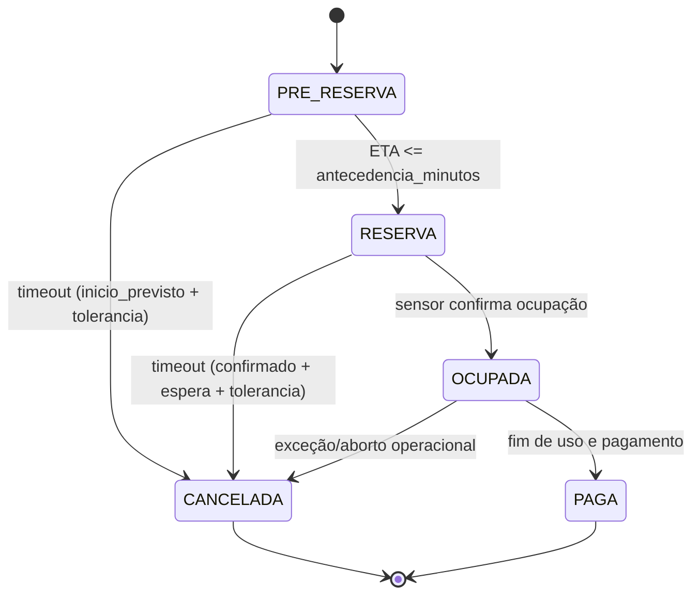

# EasyPark — API Java

> Sistema multi-estacionamento com **reservas em estágios** (PRE_RESERVA → RESERVA → OCUPADA → PAGA/CANCELADA), **monitoramento em tempo real** via sensores de vaga e **pagamento pós-uso**. Integra com **Oracle** e usa **ETA** (Google Maps Directions) para promover PRE_RESERVA → RESERVA.

**Status atual:** Sprint 3 — aplicação Spring Boot com API REST, interface web Thymeleaf, Flyway, Spring Security, integração Firebase opcional e fluxos acadêmicos de reserva/operação.
**Repositório:** `kgb-fiap/easypark-java`

---

## Integrantes

- **Gabriel Cruz Ferreira** — RM559613
- **Kauã Ferreira dos Santos** — RM560992
- **Vinicius da Silva Bitú** — RM560227

---

## Sumário
- [Integrantes](#integrantes)
- [Visão Geral](#visão-geral)
- [Arquitetura](#arquitetura)
- [Domínio e Modelo de Dados](#domínio-e-modelo-de-dados)
- [Fluxo de Reserva](#fluxo-de-reserva)
- [Stack Tecnológica](#stack-tecnológica)
- [Como Executar Localmente](#como-executar-localmente)
- [Documentação da API (Swagger/OpenAPI)](#documentação-da-api-swaggeropenapi)
- [Padrões REST e HATEOAS](#padrões-rest-e-hateoas)
- [Testes (Postman)](#testes-postmaninsomnia)
- [Evolução Sprint 1 → Sprint 2](#evolução-sprint-1--sprint-2)
- [Sprint 3](#sprint-3)
- [Roadmap](#roadmap)
- [Anexos (Diagramas)](#anexos-diagramas)

---

## Visão Geral
O **EasyPark** é uma aplicação Spring Boot com API REST e interface web acadêmica que orquestra:
- **Reservas em estágios** com regra guiada por **ETA** (Google Maps) e **eventos de sensores**;
- **Telemetria de vagas**: histórico (`SENSOR_EVENTO`) e cache de leitura (`VAGA_STATUS`);
- **Busca de estacionamentos e vagas** para o fluxo do motorista;
- **Operação de sensores e timeouts** para o perfil operador;
- **Controle de acesso** com Spring Security e integração opcional com Firebase Auth;
- **Versionamento do banco Oracle** com Flyway;
- **Pagamento pós-uso** (gateway planejado para evolução futura);
- **Endereços** normalizados em **3FN** (UF/CIDADE/BAIRRO/ENDERECO).

**Público-alvo:** motoristas urbanos (reserva e navegação até a vaga) e **operadoras/estacionamentos** (gestão de ocupação e rotatividade).

---

## Arquitetura
> `docs/arquitetura-easypark.png`

---

## Domínio e Modelo de Dados
> DER (imagem): `docs/der-easypark.png`.

### Principais entidades (propósito)
| Entidade | Propósito (resumo) |
|---|---|
| **OPERADORA** | Dados da operadora (CNPJ, razão social, etc.). |
| **ESTACIONAMENTO** | Pertence a uma operadora; referencia **ENDERECO**; parâmetros: `espera_minutos`, `tolerancia_minutos`, `max_antecedencia_minutos`, `limite_no_show`. |
| **NIVEL** | Andares/setores do estacionamento. |
| **TIPO_VAGA** | Classificação e **tarifa_por_minuto** (ex.: elétrica, acessível, moto). |
| **VAGA** | Vaga física; liga **NIVEL** e **TIPO_VAGA**; ativa/inativa. |
| **SENSOR** | Dispositivo por vaga; metadados do hardware. |
| **SENSOR_EVENTO** | Histórico de leituras (OCUPADA, LIVRE, DESCONHECIDO) e timestamps. |
| **VAGA_STATUS** | **Cache** 1:1 do último status da vaga (fonte de verdade = histórico). |
| **USUARIO** | Autenticação básica, perfis (cliente/operador/admin), suspensão/no-show. |
| **RESERVA** | Ciclo de vida; timestamps (confirmado, ocupado, pago), antecedência escolhida pelo usuário. |
| **RESERVA_PRECO (1:1)** | **Snapshot** de parâmetros de preço (reprodutibilidade). |
| **RESERVA_HIST** | Auditoria das transições (origem: ETA, SENSOR, TIMEOUT…). |
| **PAGAMENTO / PAGAMENTO_PAGADOR / PAGAMENTO_CARTAO** | Integração com gateway (idempotência, provider, token/cartão, pagador com ENDERECO). |
| **UF / CIDADE / BAIRRO / ENDERECO** | Domínio de endereço em **3FN** (UF = sigla como PK). |

**Regras de concorrência**
- **0..1 reserva ativa por VAGA** (estados PRE_RESERVA/RESERVA/OCUPADA).  
- **0..1 reserva ativa por USUÁRIO**.

**Preço e históricos**
- Tarifa vem de **TIPO_VAGA**; **RESERVA_PRECO** guarda snapshot.  
- **SENSOR_EVENTO** (telemetria) e **RESERVA_HIST** (auditoria).

---

## Fluxo de Reserva

**Resumo operacional**
1. **PRE_RESERVA:** usuário escolhe `antecedencia_minutos`.  
   • Quando **ETA ≤ antecedencia_minutos** → vira **RESERVA** (vaga bloqueada).  
2. **RESERVA:** chegada confirmada por **sensor** (ou manual) → **OCUPADA**.  
3. **OCUPADA:** ao finalizar uso → **PAGA** (ou **CANCELADA** conforme regra).  
4. **Conflitos:** se sensor marca OCUPADA antes da confirmação, registrar em histórico/operacional.

**Timeouts**
- **PRE_RESERVA** expira se `agora > inicio_previsto + tolerancia_minutos` (ESTACIONAMENTO).  
- **RESERVA** cancela se `agora > confirmado_em + (espera_minutos + tolerancia_minutos)`.

### Diagrama de estados (Mermaid)

```mermaid
stateDiagram-v2
    [*] --> PRE_RESERVA
    PRE_RESERVA --> RESERVA: ETA <= antecedencia_minutos
    PRE_RESERVA --> CANCELADA: timeout (inicio_previsto + tolerancia)
    RESERVA --> OCUPADA: sensor confirma ocupação
    RESERVA --> CANCELADA: timeout (confirmado + espera + tolerancia)
    OCUPADA --> PAGA: fim de uso e pagamento
    OCUPADA --> CANCELADA: exceção/aborto operacional
    CANCELADA --> [*]
    PAGA --> [*]
```

---

## Stack Tecnológica
- **Java**: JDK **21+**  
- **Spring Boot** (Web, Validation)  
- **Spring Data JPA**  
- **Spring HATEOAS** 
- **Spring Security**
- **Thymeleaf** e **Thymeleaf Extras Spring Security**
- **Flyway** e **Flyway Oracle**
- **Firebase Admin SDK**
- **Oracle** (JDBC, HikariCP)  
- **springdoc-openapi** (Swagger UI)  
- **Lombok** 

---

## Como Executar Localmente

### 1) Pré-requisitos
- **JDK**: 21+ 
- **Maven**: 3.9+ (ou `./mvnw`)  
- **Oracle DB**: XE/SE/EE disponível (local/remoto)  
- **Google Maps API Key**: *(ainda não está disponivel)*

### 2) Banco de dados
Crie ou reutilize um schema Oracle. O versionamento do banco é feito pelo Flyway em `src/main/resources/db/migration`.

- **Migrations da aplicação**: `src/main/resources/db/migration`
- **Scripts históricos da Sprint 2**: `docs/sql`

O Flyway usa `baseline-on-migrate=true` e `baseline-version=3`, permitindo conectar em um schema Oracle que já recebeu os scripts da Sprint 2 sem excluir os dados existentes.

### 3) Configuração da aplicação

`src/main/resources/application.properties`
```properties
spring.datasource.url=${DB_EASYPARK_URL}
spring.datasource.username=${DB_EASYPARK_USER}
spring.datasource.password=${DB_EASYPARK_PASS}
```

> **Variáveis de ambiente**: `DB_EASYPARK_URL`, `DB_EASYPARK_USER`, `DB_EASYPARK_PASS`

Configuração opcional para Firebase Auth:

```powershell
$env:FIREBASE_ENABLED="true"
$env:FIREBASE_PROJECT_ID="seu-project-id"
$env:FIREBASE_CREDENTIALS_JSON="{...json da service account em uma linha...}"
$env:FIREBASE_ALLOWED_ORIGINS="http://localhost:5173,http://localhost:3000"
$env:FIREBASE_DEFAULT_ROLE="MOTORISTA"
```

Também é possível usar `FIREBASE_CREDENTIALS_PATH` apontando para o JSON da service account local. O arquivo JSON não deve ser commitado.

### 4) Rodando a API
- **Maven (dev)**
  ```bash
  cd easypark
  ./mvnw clean test
  ./mvnw spring-boot:run
  # ou
  ./mvnw clean package && java -jar target/easypark-*.jar
  ```

### 5) Ambientes de acesso
- **Local**: `http://localhost:8080`
- **Azure**: `https://api-easypark-agh6f3dugbemcfbh.brazilsouth-01.azurewebsites.net`

O deploy no Azure é feito por CI/CD via GitHub Actions.
---

## Documentação da API (Swagger/OpenAPI)
- **Swagger UI (local)**  
  - `http://localhost:8080/swagger-ui.html` **ou** `http://localhost:8080/swagger-ui/index.html`
- **Swagger UI (Azure)**
  - `https://api-easypark-agh6f3dugbemcfbh.brazilsouth-01.azurewebsites.net/swagger-ui.html`
- **OpenAPI JSON**  
  - `http://localhost:8080/v3/api-docs`
  - `https://api-easypark-agh6f3dugbemcfbh.brazilsouth-01.azurewebsites.net/v3/api-docs`

---

## Padrões REST e HATEOAS
- **Controllers** com `ResponseEntity<T>` e **tipagem explícita** (feedback S1).  
- **Validação** com Bean Validation (DTOs anotados).  
- **HATEOAS (início)**: inclusão de `_links` para navegação entre recursos.

### Exemplo de payload HATEOAS (reserva)
```json
{
  "id": 123,
  "estado": "RESERVA",
  "vagaId": 45,
  "usuarioId": 9,
  "inicioPrevisto": "2025-11-10T14:35:00-03:00",
  "_links": {
    "self": {"href": "/api/reservas/123"},
    "vaga": {"href": "/api/vagas/45"},
    "usuario": {"href": "/api/usuarios/9"},
    "confirmar-ocupacao": {"href": "/api/reservas/123/ocupar", "method": "POST"},
    "cancelar": {"href": "/api/reservas/123/cancelar", "method": "POST"}
  }
}
```

---

## Testes (Postman/Insomnia)

- `docs/postman/EasyPark.postman_collection.json` 
- `docs/postman/EasyPark-local.postman_environment.json` 

**Como usar**
1. Importar a coleção e o ambiente.  
2. Ajustar `baseUrl = http://localhost:8080`.  
3. Executar sequência: Operadora → Endereço → Estacionamento → Nível → TipoVaga → Vaga → Reserva → Jobs (timeouts) → Consulta status.

---

## Evolução Sprint 1 → Sprint 2

**Feedback Sprint 1 e ações**
- **Cronograma do projeto** — **PENDENTE**.  
- **Controllers**: padronizar **`ResponseEntity<T>`**; empilhar anotações com clareza → **Aplicado** nos controllers principais.  
- **Evitar Lombok em Services** → **Revisado**: Lombok mantido em entidades/DTOs; Services sem Lombok.

**Melhorias Sprint 2**
- Controllers atualizados para usar ResponseEntity tipado e serviços com injeção via construtor explícito, eliminando Lombok da camada de negócio.
- Novo modelo de endereço criado (UF, Cidade, Bairro e Endereco) e associação do estacionamento ao ENDERECO_ID, com DTOs e mapper ajustados para o relacionamento.
- Ajustes complementares no tratamento global de erros, metadados OpenAPI, documentação e coleções Postman com o uso de enderecoId nas requisições.
- Início de **HATEOAS** (maturidade REST 3).  
- Documentação OpenAPI ampliada; padronização de exceções (handler global) e códigos HTTP.

---

## Atendimento às Exigências das Sprints

### Sprint 1
- API **REST** com **POO/JPA/Hibernate**.  
- **Maturidade REST nível 1** atingida.  
- **GitHub público**, documentação e **Swagger/OpenAPI**.  
- **Testes de endpoints** (Postman).

### Sprint 2
- **Evolução do código** (refatorações, padrão de respostas, exceções).  
- **HATEOAS** (nível de maturidade **3** — inicial, com `_links`).  
- **Gestão de configuração** contínua (GitHub, versionamento).

**Checklist de entrega**
- [x] DER (PNG) e Arquitetura (PNG) em `docs/`  
- [ ] Cronograma/Responsáveis em `docs/cronograma-s1-s2.pdf`  
- [x] Coleção Postman em `docs/postman/`  
- [x] Link de vídeo de apresentação ([EasyPark - Pitch](https://youtu.be/lVp7S25vAQ8?si=YolhGwtarLyjFa1c))

## Sprint 3

Esta sprint adiciona uma aplicacao web academica com Thymeleaf, Flyway para versionamento do banco Oracle, Spring Security para autenticacao e controle de acesso, e integracao backend com Firebase Authentication para o futuro frontend React.

O frontend principal em React ainda nao consome os fluxos REST de negocio, mas o backend ja aceita a validacao de ID tokens do Firebase quando `firebase.enabled=true`. Nesta entrega, a API REST atual permanece publica para preservar compatibilidade, mas pode receber `Authorization: Bearer <idToken>` e popular o usuario autenticado no Spring Security.

### Stack adicionada

- Spring Security
- Thymeleaf
- Thymeleaf Extras Spring Security
- Flyway
- Flyway Oracle
- Firebase Admin SDK

### URLs web

- Login web: `http://localhost:8080/web/login`
- Login web Azure: `https://api-easypark-agh6f3dugbemcfbh.brazilsouth-01.azurewebsites.net/web/login`
- Busca de destino: `http://localhost:8080/web`
- Busca de destino Azure: `https://api-easypark-agh6f3dugbemcfbh.brazilsouth-01.azurewebsites.net/web`
- Consulta de estacionamentos: `http://localhost:8080/web/estacionamentos`
- Consulta de estacionamentos Azure: `https://api-easypark-agh6f3dugbemcfbh.brazilsouth-01.azurewebsites.net/web/estacionamentos`
- Detalhe de estacionamento e vagas: `http://localhost:8080/web/estacionamentos/{id}`
- Rotas antigas de vagas: `/web/vagas` e `/web/vagas/{id}` redirecionam para o fluxo por estacionamento
- Minhas reservas: `http://localhost:8080/web/minhas-reservas`
- Painel operador: `http://localhost:8080/web/operador`
- Status Firebase: `http://localhost:8080/auth/firebase/status`
- Usuario Firebase autenticado: `http://localhost:8080/auth/firebase/me`

### Usuarios academicos

Os usuarios abaixo sao criados pela migration `V4__seed_sprint_3_security_users.sql` com senha BCrypt.

| Perfil | E-mail | Senha | Permissoes |
|---|---|---|---|
| Motorista | `easypark.motorista@fiap.com.br` | `motorista123` | Acessa `/web`, `/web/estacionamentos` e `/web/minhas-reservas` |
| Operador | `easypark.operador@fiap.com.br` | `operador123` | Acessa rotas de motorista e `/web/operador` |
| Admin | `easypark.admin@fiap.com.br` | `admin123` | Acessa rotas de motorista e `/web/operador` |

Mapeamento de roles:

- `cliente` -> `ROLE_MOTORISTA`
- `operador` -> `ROLE_MOTORISTA`, `ROLE_OPERADOR`
- `admin` -> `ROLE_MOTORISTA`, `ROLE_OPERADOR`, `ROLE_ADMIN`

Usuarios com `suspenso = 'Y'` ou `suspensao_ate` futura ficam bloqueados para login.

### Flyway

As migrations ficam em `easypark/src/main/resources/db/migration`:

- `V1__create_easypark_schema_sprint_1.sql`: schema base do EasyPark.
- `V2__create_reserva_triggers_and_jobs.sql`: trigger de sensor, ETA e timeouts.
- `V3__apply_sprint_2_database_evolution.sql`: evolucao entregue na Sprint 2.
- `V4__seed_sprint_3_security_users.sql`: usuarios academicos da Sprint 3.

O Flyway esta configurado com `baseline-on-migrate=true` e `baseline-version=3`. Isso permite conectar em um schema Oracle existente da Sprint 2, ja populado, sem apagar dados. Em schema limpo, as migrations V1 a V4 podem ser aplicadas em sequencia.

Os scripts historicos entregues na Sprint 2 foram preservados em `easypark/docs/sql`. Eles servem como referencia documental e nao substituem as migrations versionadas.

### Spring Security e Firebase

A seguranca foi separada por escopo:

- `/web/**`: autenticado com formulario Spring Security.
- `/web/operador/**`: exige `ROLE_OPERADOR` ou `ROLE_ADMIN`.
- `/auth/firebase/status`: publico, usado para conferir se a integracao Firebase esta habilitada e inicializada.
- `/auth/firebase/me`: exige `Authorization: Bearer <idToken>` valido quando Firebase estiver habilitado.
- Demais endpoints REST: permanecem publicos nesta sprint, mas aceitam o filtro opcional de Firebase quando o token for enviado.

Firebase e Spring Security coexistem nesta implementacao. O React deve autenticar o usuario no Firebase Client SDK e enviar o ID token nas chamadas ao backend:

```javascript
const token = await firebase.auth().currentUser.getIdToken();
await fetch("http://localhost:8080/auth/firebase/me", {
  headers: { Authorization: `Bearer ${token}` }
});
```

Configuracao do backend:

```powershell
$env:FIREBASE_ENABLED="true"
$env:FIREBASE_PROJECT_ID="seu-project-id"
$env:FIREBASE_CREDENTIALS_JSON="{...json da service account em uma linha...}"
$env:FIREBASE_ALLOWED_ORIGINS="http://localhost:5173,http://localhost:3000"
$env:FIREBASE_DEFAULT_ROLE="MOTORISTA"
```

Tambem e possivel usar `FIREBASE_CREDENTIALS_PATH` apontando para o JSON local da service account. Se `FIREBASE_CREDENTIALS_JSON` e `FIREBASE_CREDENTIALS_PATH` nao forem informados, a aplicacao tenta usar Application Default Credentials do Google. O arquivo JSON da service account nao deve ser commitado.

Mapeamento de claims Firebase:

- claim `roles`, `role` ou `perfil` com `admin` -> `ROLE_MOTORISTA`, `ROLE_OPERADOR`, `ROLE_ADMIN`;
- claim `roles`, `role` ou `perfil` com `operador` -> `ROLE_MOTORISTA`, `ROLE_OPERADOR`;
- claim `roles`, `role` ou `perfil` com `cliente` ou `motorista` -> `ROLE_MOTORISTA`;
- sem claim de perfil -> `FIREBASE_DEFAULT_ROLE`, por padrao `MOTORISTA`.

### Fluxos implementados

Fluxo motorista:

- buscar destino em `/web`;
- consultar estacionamentos em `/web/estacionamentos`;
- abrir detalhe de um estacionamento e escolher uma vaga disponivel;
- criar `PRE_RESERVA` usando a procedure `reserva_ins`;
- calcular valor previsto no Java usando dados do Oracle;
- acompanhar reservas em `/web/minhas-reservas`;
- atualizar ETA usando `user_eta_update_process`, permitindo a transicao `PRE_RESERVA -> RESERVA` quando a regra de antecedencia for atendida.

Fluxo operador:

- consultar reservas recentes em `/web/operador`;
- consultar sensores ativos;
- registrar evento de sensor usando `sensor_evento_ins`, com a vaga derivada do sensor selecionado;
- atualizar status da vaga por trigger `trg_sensor_evento_after_insert`;
- executar timeouts com `reserva_prereserva_timeouts` e `reserva_timeouts`.

Pagamento real ficou fora do escopo da Sprint 3.

### Validacoes

- pre-reserva: inicio previsto presente e futuro/presente, duracao entre 15 e 1440 minutos, antecedencia entre 0 e 240 minutos;
- ETA: valor entre 0 e 240 minutos;
- evento de sensor: sensor ativo, vaga derivada do sensor selecionado, status `LIVRE`, `OCUPADA` ou `DESCONHECIDO`, payload com ate 4000 caracteres.

### Roteiro de demonstracao

1. Executar `.\mvnw.cmd clean test` dentro de `easypark`.
2. Executar `.\mvnw.cmd spring-boot:run` dentro de `easypark`.
3. Acessar `/web/login` com o usuario motorista.
4. Buscar um destino em `/web` ou abrir `/web/estacionamentos`.
5. Abrir um estacionamento, escolher uma vaga disponivel e criar uma pre-reserva.
6. Acessar `/web/minhas-reservas` e atualizar o ETA.
7. Entrar com usuario operador.
8. Acessar `/web/operador`, registrar evento de sensor e consultar o status atualizado.
9. Executar timeouts apenas em cenario preparado, pois eles alteram dados reais do Oracle.
10. Abrir `/swagger-ui.html` para conferir que a API REST continua disponivel.

### Limitacoes conhecidas

- Os fluxos de pre-reserva, sensor e timeouts alteram dados reais do Oracle; para demonstracao, use massa de teste controlada.
- O React segue como frontend principal futuro; nesta sprint o backend ja valida tokens Firebase, mas os fluxos REST de negocio ainda nao foram adaptados para exigir autenticacao Firebase obrigatoria.
- A camada web Thymeleaf e academica e existe para atender aos requisitos da Sprint 3 Java.

### Documentacao da Sprint 3

- DER PlantUML: `easypark/docs/der-logico-plantUML.puml`
- Scripts SQL historicos: `easypark/docs/sql`
- Colecao Postman: `easypark/docs/postman`

---

## Roadmap
- **React integrado à API REST** usando Firebase Auth como autenticação principal do frontend.
- **Pagamento online integrado** (gateway BR: tokenização, idempotência).  
- **Integração IoT avançada** (MQTT/Kafka; resiliência a falhas).  
- **ETA automático** por reserva; navegação passo a passo.   

---

## Anexos (Diagramas)
### Diagrama de classe
> `docs/diagrama-classe-easypark.png`.

### DER — PlantUML 
> `docs/der-easypark.png`.


```plantuml
@startuml
' DER (lógico) – Notação Barker / Crow's Foot com atributos
left to right direction
skinparam shadowing false
skinparam linetype ortho
skinparam dpi 150

entity "OPERADORA" as OPERADORA {
  * id : NUMBER <<PK>>
  cnpj : VARCHAR2(14)
  razao_social : VARCHAR2(250)
  nome_fantasia : VARCHAR2(250)
  telefone : VARCHAR2(30)
  criado_em : TIMESTAMP WITH TIME ZONE
}

entity "ESTACIONAMENTO" as ESTAC {
  * id : NUMBER <<PK>>
  operadora_id : NUMBER <<FK>>
  nome : VARCHAR2(250)
  endereco_id : NUMBER <<FK>>
  espera_minutos : NUMBER
  tolerancia_minutos : NUMBER
  limite_no_show : NUMBER
  max_antecedencia_minutos : NUMBER
  max_antecedencia_minutos_suspenso : NUMBER
  criado_em : TIMESTAMP WITH TIME ZONE
}

entity "NIVEL" as NIVEL {
  * id : NUMBER <<PK>>
  estacionamento_id : NUMBER <<FK>>
  nome : VARCHAR2(150)
  ordem : NUMBER
  criado_em : TIMESTAMP WITH TIME ZONE
}

entity "TIPO_VAGA" as TIPO {
  * id : NUMBER <<PK>>
  nome : VARCHAR2(50)
  eh_eletrica : CHAR(1)
  eh_acessivel : CHAR(1)
  eh_moto : CHAR(1)
  tarifa_por_minuto : NUMBER(12,4)
}

entity "VAGA" as VAGA {
  * id : NUMBER <<PK>>
  nivel_id : NUMBER <<FK>>
  codigo : VARCHAR2(50)
  tipo_vaga_id : NUMBER <<FK>>
  ativa : CHAR(1)
  criado_em : TIMESTAMP WITH TIME ZONE
}

entity "SENSOR" as SENSOR {
  * id : NUMBER <<PK>>
  vaga_id : NUMBER <<FK>>
  modelo : VARCHAR2(100)
  identificador_externo : VARCHAR2(200)
  ativo : CHAR(1)
  config : VARCHAR2(4000)
  criado_em : TIMESTAMP WITH TIME ZONE
}

entity "SENSOR_EVENTO" as SEVT {
  * id : NUMBER <<PK>>
  sensor_id : NUMBER <<FK>>
  vaga_id : NUMBER <<FK>>
  ocorrido_em : TIMESTAMP WITH TIME ZONE
  recebido_em : TIMESTAMP WITH TIME ZONE
  status : VARCHAR2(30)
  payload : VARCHAR2(4000)
}

entity "VAGA_STATUS" as VSTATUS {
  * vaga_id : NUMBER <<PK, FK>>
  status_ocupacao : VARCHAR2(30)
  ultimo_ocorrido : TIMESTAMP WITH TIME ZONE
  sensor_id : NUMBER <<FK>>
}

entity "USUARIO" as USUARIO {
  * id : NUMBER <<PK>>
  nome : VARCHAR2(250)
  email : VARCHAR2(320)
  senha_hash : VARCHAR2(255)
  telefone : VARCHAR2(30)
  perfil : VARCHAR2(20)
  suspenso : CHAR(1)
  no_shows : NUMBER
  suspensao_ate : TIMESTAMP WITH TIME ZONE
  criado_em : TIMESTAMP WITH TIME ZONE
}

entity "RESERVA" as RESERVA {
  * id : NUMBER <<PK>>
  usuario_id : NUMBER <<FK>>
  vaga_id : NUMBER <<FK>>
  estado : VARCHAR2(20)
  criado_em : TIMESTAMP WITH TIME ZONE
  inicio_previsto : TIMESTAMP WITH TIME ZONE
  duracao_minutos : NUMBER
  antecedencia_minutos : NUMBER
  confirmado_em : TIMESTAMP WITH TIME ZONE
  ocupado_em : TIMESTAMP WITH TIME ZONE
  pago_em : TIMESTAMP WITH TIME ZONE
  motivo_cancelamento : VARCHAR2(4000)
  vaga_bloqueada : CHAR(1)
  eta_origem : VARCHAR2(100)
  eta_minutos : NUMBER
  eta_atualizado_em : TIMESTAMP WITH TIME ZONE
}

entity "RESERVA_PRECO" as RPRECO {
  * reserva_id : NUMBER <<PK, FK>>
  tarifa_por_minuto : NUMBER(12,4)
  percentual_antecedencia : NUMBER(8,6)
  antecedencia_minutos_aplicada : NUMBER
  observacao : VARCHAR2(200)
  valor_previsto : NUMBER(12,4)
  valor_final : NUMBER(12,4)
  moeda : VARCHAR2(3)
  calculado_em : TIMESTAMP WITH TIME ZONE
}

entity "RESERVA_HIST" as RHIST {
  * id : NUMBER <<PK>>
  reserva_id : NUMBER <<FK>>
  from_estado : VARCHAR2(20)
  to_estado : VARCHAR2(20)
  origem_evento : VARCHAR2(20)
  referencia_id : NUMBER
  observacao : VARCHAR2(200)
  ocorrido_em : TIMESTAMP WITH TIME ZONE
}

entity "PAGAMENTO" as PAGTO {
  * id : NUMBER <<PK>>
  reserva_id : NUMBER <<FK>>
  usuario_id : NUMBER <<FK>>
  valor : NUMBER(12,4)
  status : VARCHAR2(30)
  criado_em : TIMESTAMP WITH TIME ZONE
  metodo_pagamento : VARCHAR2(20)
  idempotencia_chave : VARCHAR2(64)
  gateway_provider : VARCHAR2(100)
  gateway_tx_id : VARCHAR2(200)
  gateway_response : VARCHAR2(4000)
}

entity "PAGAMENTO_PAGADOR" as PPAG {
  * pagamento_id : NUMBER <<PK, FK>>
  nome : VARCHAR2(150)
  cpf_cnpj : VARCHAR2(14)
  email : VARCHAR2(320)
  telefone : VARCHAR2(30)
  endereco_id : NUMBER <<FK>>
}

entity "PAGAMENTO_CARTAO" as PCART {
  * pagamento_id : NUMBER <<PK, FK>>
  token : VARCHAR2(200)
  bandeira : VARCHAR2(20)
  final_cartao : VARCHAR2(4)
  titular_nome : VARCHAR2(150)
}

' --- Endereço em 3FN ---
entity "UF" as UF {
  * sigla : VARCHAR2(2) <<PK>>
  nome    : VARCHAR2(50)
}

entity "CIDADE" as CIDADE {
  * id      : NUMBER <<PK>>
  nome      : VARCHAR2(80)
  uf_sigla  : VARCHAR2(2) <<FK>>
}

entity "BAIRRO" as BAIRRO {
  * id        : NUMBER <<PK>>
  nome        : VARCHAR2(80)
  cidade_id   : NUMBER <<FK>>
}

entity "ENDERECO" as END {
  * id          : NUMBER <<PK>>
  cep           : VARCHAR2(10)
  logradouro    : VARCHAR2(150)
  numero        : VARCHAR2(20)
  complemento   : VARCHAR2(50)
  bairro_id     : NUMBER <<FK>>
  latitude      : NUMBER(9,6)
  longitude     : NUMBER(9,6)
}

' Relacionamentos
OPERADORA      ||--o{ ESTAC
ESTAC          ||--o{ NIVEL
NIVEL          ||--o{ VAGA
TIPO           ||--o{ VAGA
VAGA           ||--o{ SENSOR
SENSOR         ||--o{ SEVT
VAGA           ||--|| VSTATUS
USUARIO        ||--o{ RESERVA
VAGA           ||--o{ RESERVA
RESERVA        ||--|| RPRECO
RESERVA        ||--o{ RHIST
RESERVA        ||--o{ PAGTO
PAGTO          ||--|| PPAG
PAGTO          ||--|| PCART
UF             ||--o{ CIDADE
CIDADE         ||--o{ BAIRRO
BAIRRO         ||--o{ END
ESTAC          ||--|| END
PPAG           |o--|| END

legend right
  Notação Barker (crow’s foot):
  || = 1 obrigatório, |o = 0..1, }| = 1..N, }o = 0..N.
endlegend
@enduml
```
